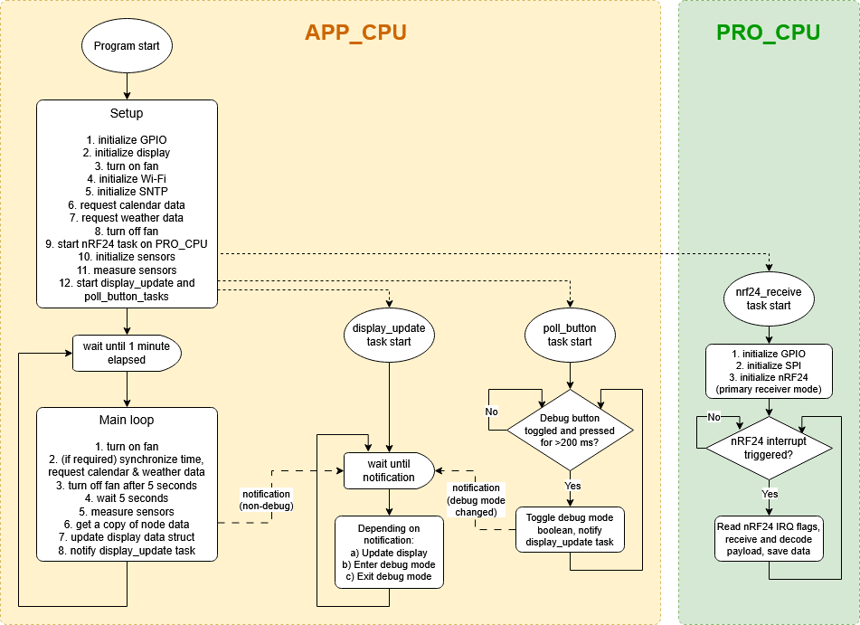
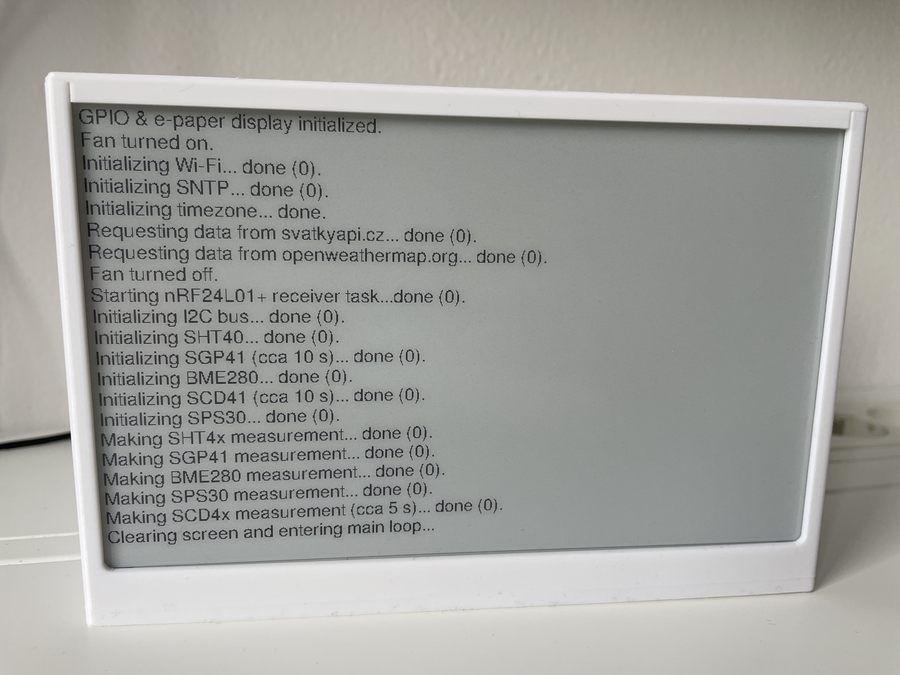
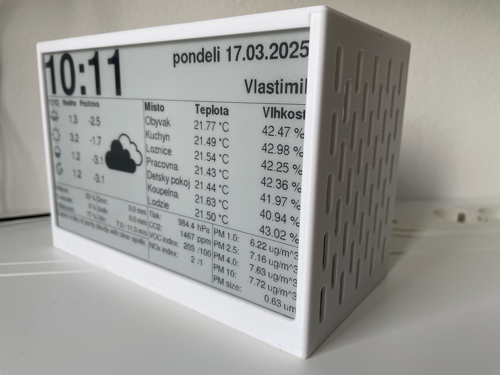
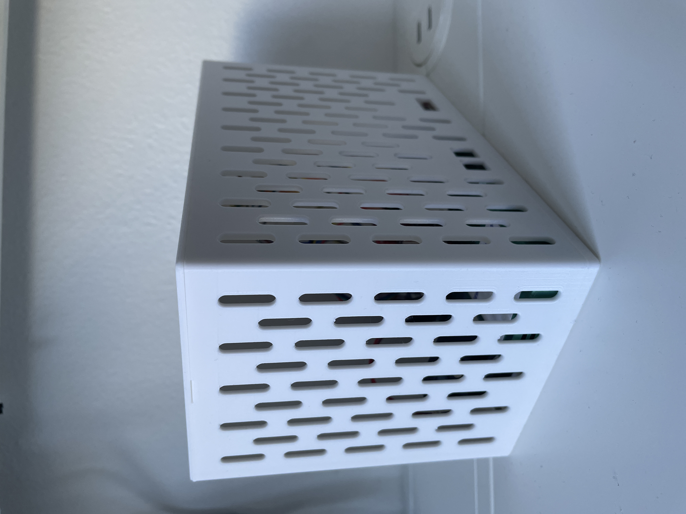

# HAMS hub

HAMS hub firmware for ESP32-S3 module is written in C and C++ and uses FreeRTOS as provided by Espressif.

The C++ language is used for the display-related code, as the CalEPD component (and its dependency Adafruit-GFX) are C++ based and utilize classes. Due to this the main file must also be a C++ file. Everything else is in plain C.

ESP32 is a chip with two CPU cores (the APP_CPU and the PRO_CPU). The PRO_CPU runs the task responsible for communication with the nRF24 radio module, whiile the APP_CPU handles everything else.

The nRF24 and SHT4x drivers are identical to the ones used in the STM32 based HAMS node, as all device drivers in this project are platform independent.

## Debug button

The debug button is located on the back of the HAMS hub enclosure, next to the reset button.

Pressing and releasing the button for more than 300 ms but less than 2 seconds will toggle the debug mode on and off. When debug mode is on, the display immediately changes to the [debug view](#debug-mode), which lists internal debug info.

Pressing and releasing the button after more than 2 seconds will schedule a SCD41 re-calibration (FRC). In the next SCD41 measurement cycle, the SCD41 will be recalibrated, assuming the current CO2 concentration is 425 ppm.

## Program flow

The application code flow is visualized in a simplified flowchart below.

Please note not all sensors take a reading every main loop cycle. For example SCD41 (CO₂ sensor) takes a reading once every 5 cycles / minutes.

## Hardware

Case dimensions are: 175 mm (W) x 92.85 mm (L) x 118 mm (H). Printed by Prusa MK4S 3D-printer, using Prusament PLA Pristine White filament.

### Front

### Debug mode

### Start-up logging

### Side shot 1

### Side shot 2

### Internals
