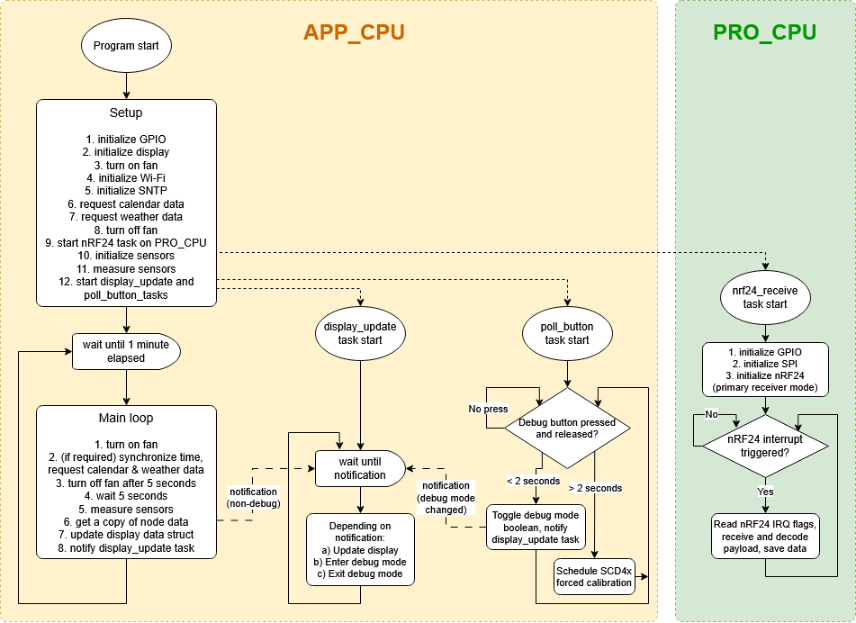

# HAMS hub firmware

HAMS hub firmware for ESP32-S3 module is written in C and C++ and uses FreeRTOS as provided by Espressif.

The C++ language is used for the display-related code, as the CalEPD component (and its dependency Adafruit-GFX) are C++ based and utilize classes. Due to this the main file must also be a C++ file. Everything else is in plain C.

ESP32 is a chip with two CPU cores (the APP_CPU and the PRO_CPU). The PRO_CPU runs the task responsible for communication with the nRF24 radio module, whiile the APP_CPU handles everything else.

The nRF24 and SHT4x drivers are identical to the ones used in the STM32 based HAMS node, as all device drivers in this project are platform independent.

## Debug mode

Pressing the debug button on the PCB will toggle the debug mode on and off. When debug mode is on, the display immediately changes to the debug view, which lists internal debug info.

TODO: add debug display photo here

## Program flow

The application code flow is visualized in a simplified flowchart below.

