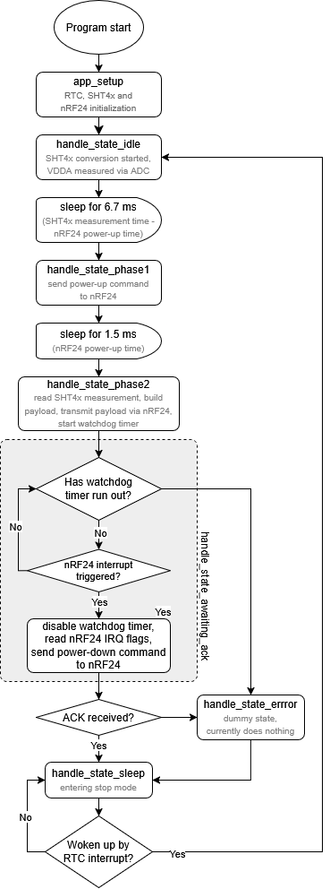
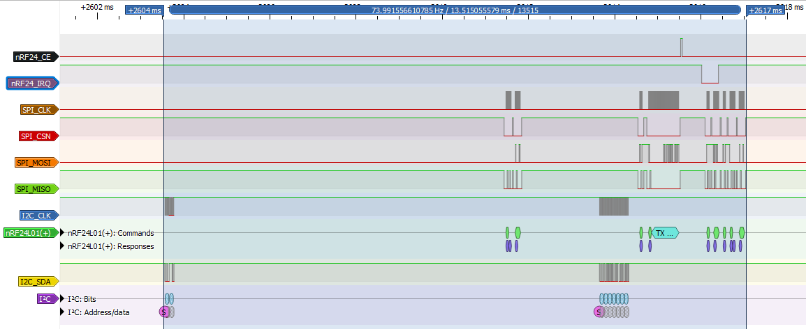
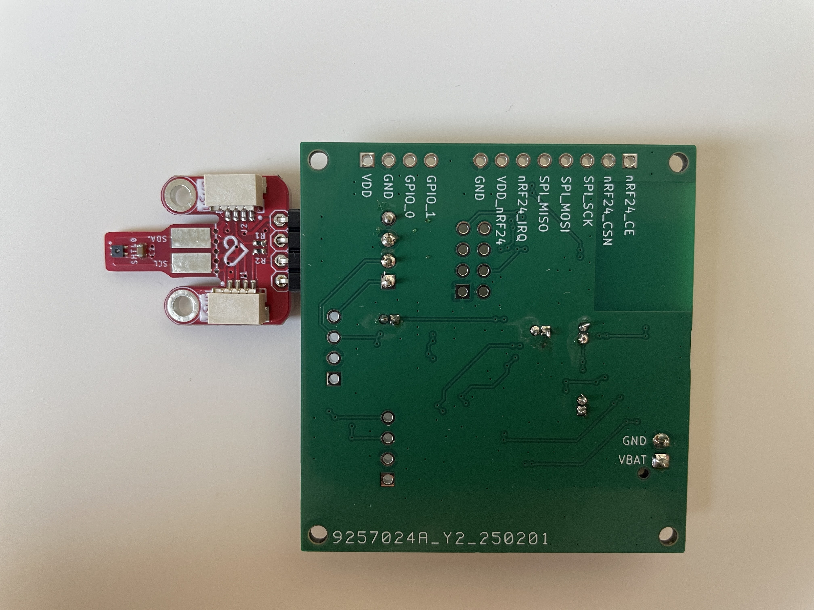
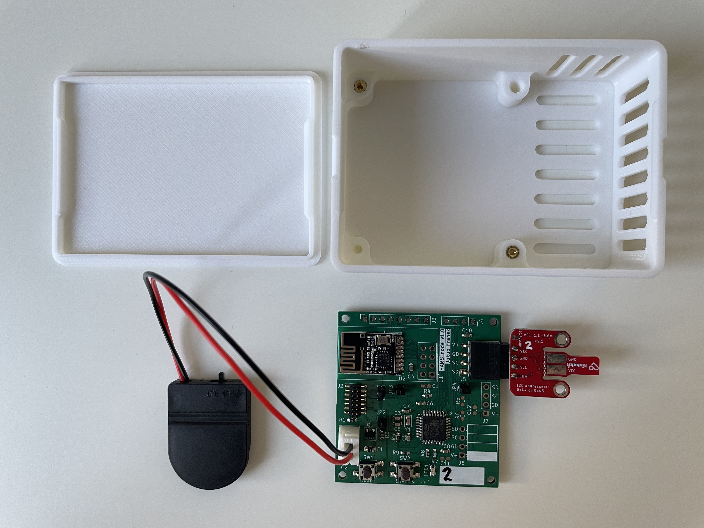
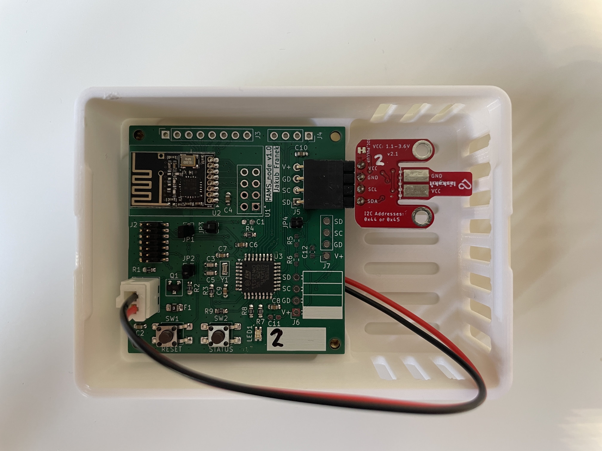
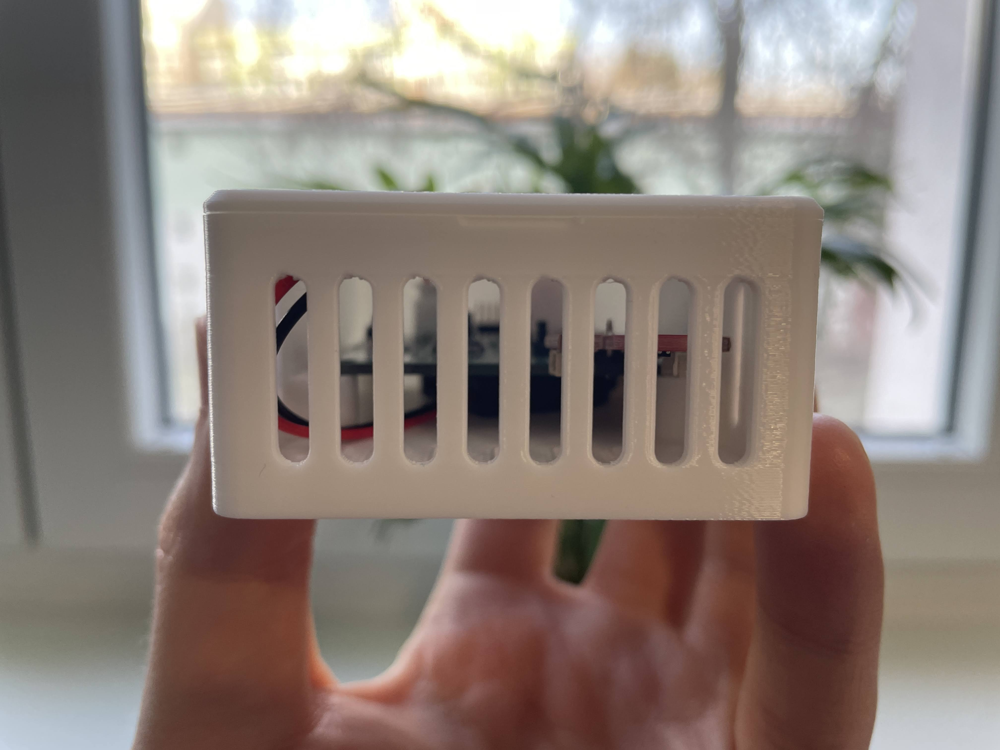
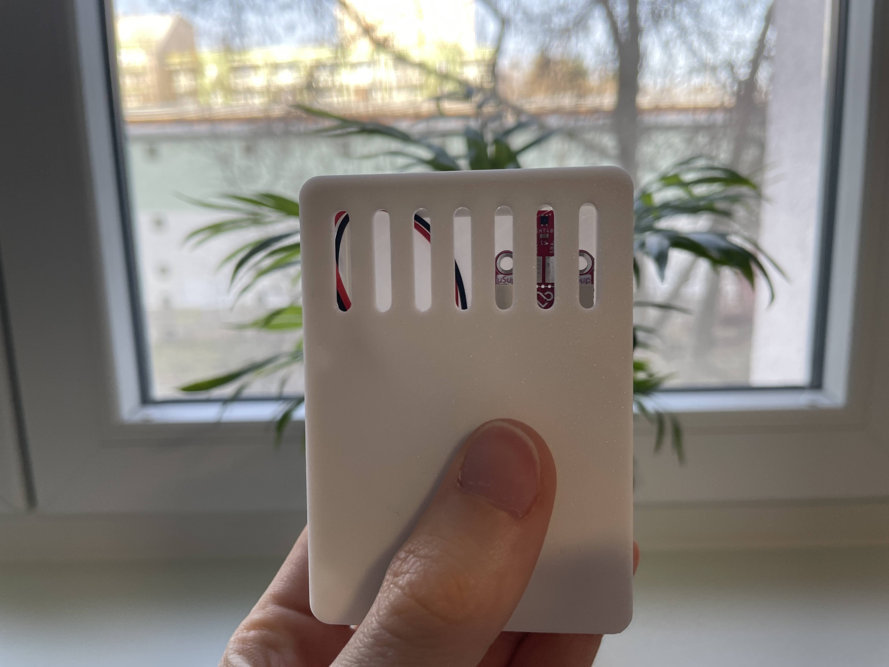

# HAMS node

HAMS node firmware for STM32L031K6 MCU is written in C and uses LL (low-layer) library as provided by ST Microelectronics, using no OS.

The nRF24 and SHT4x drivers are identical to the ones used in the ESP32 based HAMS hub, as all device drivers in this project are platform independent.

The MCU runs at 8 MHz (internal high speed oscillator), as the wake time is not determined by the MCU itself but rather by the sensor and the nRF24 module.

## Debug mode

Pressing the STATUS button on the PCB will toggle the debug mode on and off. When debug mode is on, the following effects occur:
1. debug log messages are sent via UART to the 2x7 1.27 mm pin header (accessible via ST-LINK V3 MINIE) at 38400 baud rate (because of this, the program runs slower and the wake time is longer)
2. green status LED is on (drawing up to 2 mA)
3. if there was any error since the last successfully completed loop cycle, the red error LED is on (drawing up to 2 mA)

Example UART output debug log messages are below:

```
[handle_state_sleep]woke up due to RTC: state = 0, app_status = 0, nrf24_status = 0, sht4x_status = 0, event = 4
[app_loop]: state = 1, app_status = 0, nrf24_status = 0, sht4x_status = 0, event = 0
[app_loop]: state = 2, app_status = 0, nrf24_status = 0, sht4x_status = 0, event = 0
[app_loop]: state = 3, app_status = 0, nrf24_status = 0, sht4x_status = 0, event = 0
[app_loop]: state = 4, app_status = 0, nrf24_status = 0, sht4x_status = 0, event = 0
[app_loop]: state = 0, app_status = 0, nrf24_status = 0, sht4x_status = 0, event = 0
[handle_state_sleep]entering sleep: state = 0, app_status = 0, nrf24_status = 0, sht4x_status = 0, event = 0
```

## Program flow

The application code structure is an event-driven Finite State Machine (FSM). The simplified flowchart is below.

The RTC peripheral is configured to wake up the node once every 60 seconds.



## Logic analyzer waveforms

Typical period between stop mode exit and entrance is less than 15 ms.



## Batteries and power consumption

The nodes are powered via CR2032 batteries, with a nominal voltage of 3 Volt and nominal capacity of 210 mAh.

Typical current draw in stop mode has been measured to be from 1.8 to 2.5 uA, where cca half of the consumption is due to MCU and the other half is due to the nRF24 module (SHT4x current in power down is typically 80 nA per datasheet).

To calculate average power consumption, let us make the following conservative assumptions:
- MCU draws 5 mA when not in stop mode
- SHT4x draws 500 uA when measuring
- SHT4x takes up to 8.3 ms to measure (typical 6.9 ms per datasheet)
- nRF24 module draws 12 mA when transmitting (typical 11.3 mA per datasheet) and 400 uA when active but not transmitting (typical current draw during startup per datasheet)
- transmitting takes up to 1 ms (typical less than 0.5 ms)
- total wake time is 15 ms

Under the above assumptions, the average power consumption is 4.12 uA and the battery life is 5.8 years.

## Hardware

Case dimensions are: 81 mm (L) x 58 mm (W) x 30 mm (H). Printed by Prusa MK4S 3D-printer, using Prusament PLA Pristine White filament.

### PCB front


### PCB back


### Disassembled


### Assembled box internals


### Assembled box front


### Assembled box bottom
