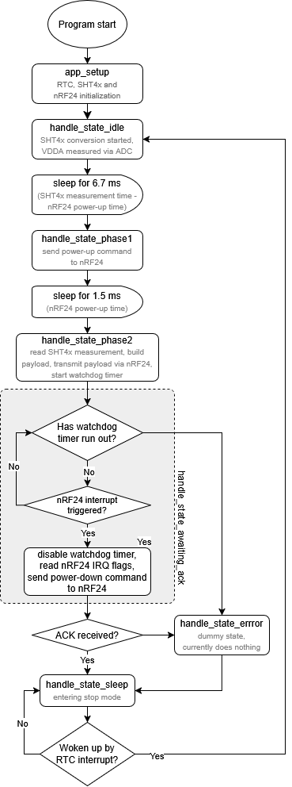

# HAMS node firmware

HAMS node firmware for STM32L031K6 MCU is written in C and uses LL (low-layer) library as provided by ST Microelectronics, using no OS.

The nRF24 and SHT4x drivers are identical to the ones used in the ESP32 based HAMS hub, as all device drivers in this project are platform independent.

## Debug mode

Pressing the STATUS button on the PCB will toggle the debug mode on and off. When debug mode is on, the following effects occur:
1. debug log messages are sent via UART to the 2x7 1.27 mm pin header (accessible via ST-LINK V3 MINIE) at 38400 baud rate
2. green status LED is on
3. if there was any error since the last successfully completed loop cycle, the red error LED is on

## Program flow

The application code structure is an event-driven Finite State Machine (FSM). The simplified flowchart is below.

## Logic analyzer waveforms

Typical period between sleep mode exit and entrance is less than 15 ms.

