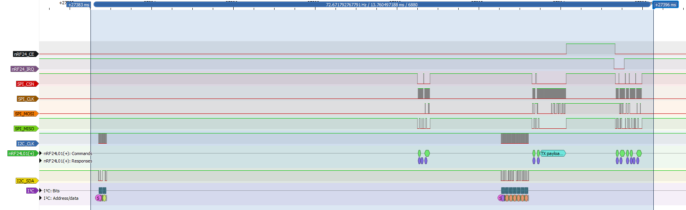
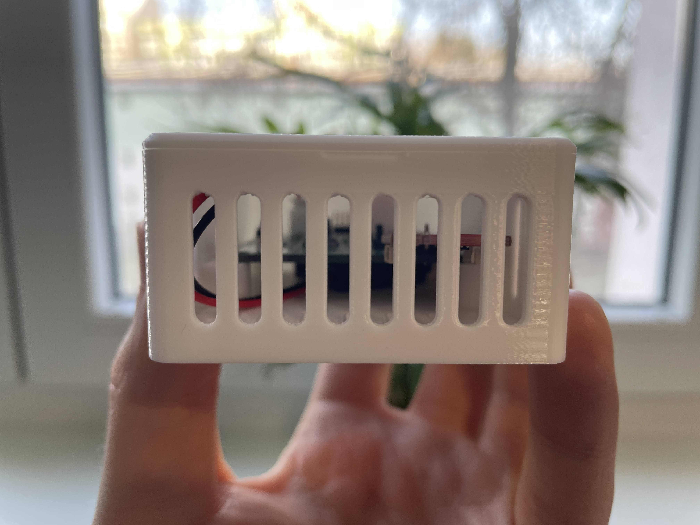
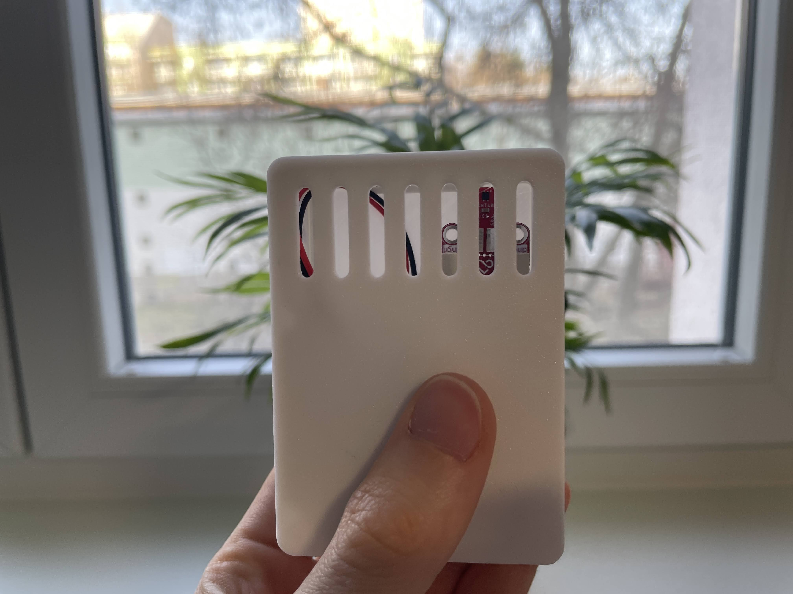

# HAMS node firmware

HAMS node firmware for STM32L031K6 MCU is written in C and uses LL (low-layer) library as provided by ST Microelectronics, using no OS.

The nRF24 and SHT4x drivers are identical to the ones used in the ESP32 based HAMS hub, as all device drivers in this project are platform independent.

## Debug mode

Pressing the STATUS button on the PCB will toggle the debug mode on and off. When debug mode is on, the following effects occur:
1. debug log messages are sent via UART to the 2x7 1.27 mm pin header (accessible via ST-LINK V3 MINIE) at 38400 baud rate
2. green status LED is on
3. if there was any error since the last successfully completed loop cycle, the red error LED is on

## Program flow

The application code structure is an event-driven Finite State Machine (FSM). The simplified flowchart is below.

## Logic analyzer waveforms

Typical period between stop mode exit and entrance is less than 15 ms.

## Batteries and power consumption

The nodes are powered via CR2032 batteries, with a nominal voltage of 3 Volt and nominal capacity of 210 mAh.

Typical current draw in stop mode has been measured to be 1.8 to 2.5 uA.

To calculate average power consumption, let us make the following conservative assumptions:
- the MCU draws 5 mA when not in stop mode
- the nRF24 module draws 15 mA when transmitting
- transmitting takes up to 2 ms
- total wake time is 15 ms

Under the above assumptions, the average power consumption is 3.74 uA and the battery life is 6.4 years.

## Hardware

Case dimensions are: 81 mm (L) x 58 mm (W) x 30 mm (H). Printed by Prusa MK4S 3D-printer, using Prusament PLA Pristine White filament.

### PCB front

### PCB back

### Disassembled

### Assembled box internals

### Assembled box front

### Assembled box bottom
