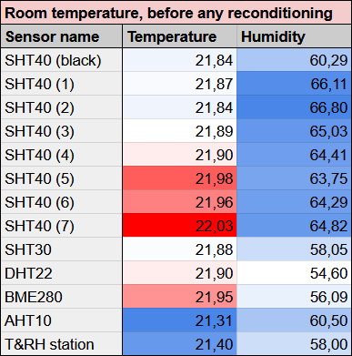
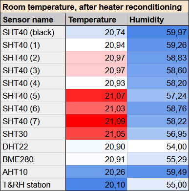
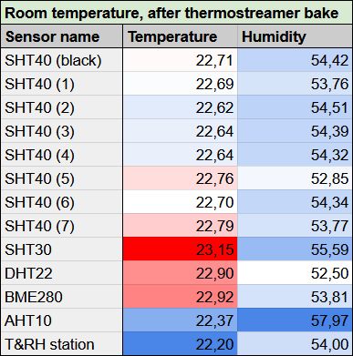
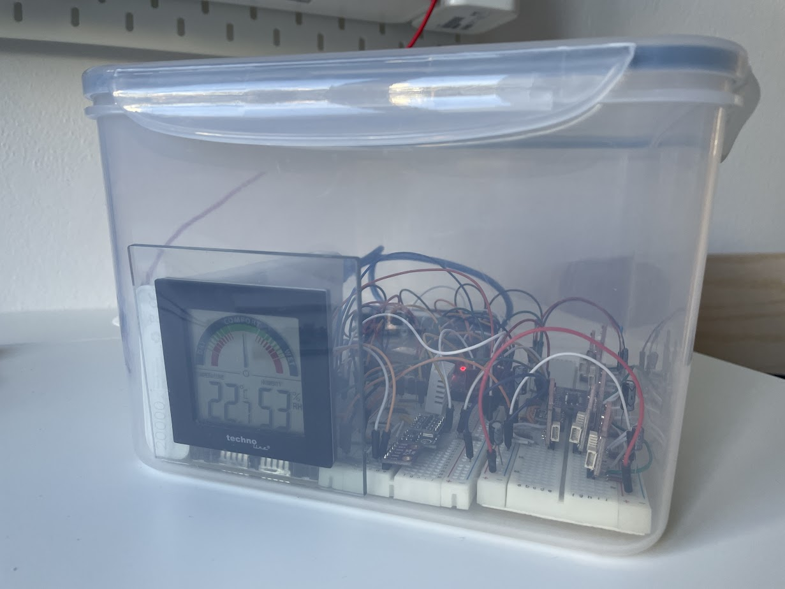
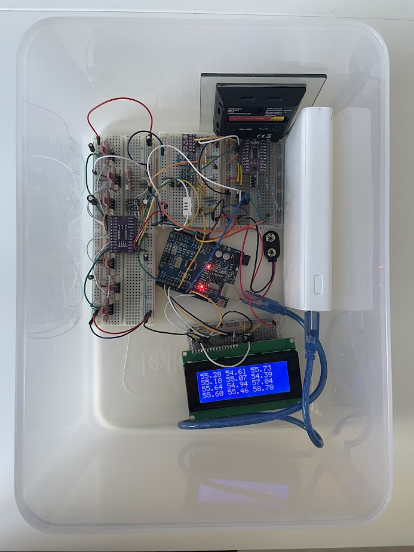
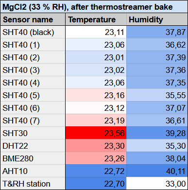

# SHT4x reconditioning and calibration

The Sensirion SHT4x temperature and humidity sensors are calibrated in the factory. However, during assembly their accuracy is negatively affected by volatile organic compounds (VOCs). This impacts humidity measurement the most.

The image below shows a table. The numbered SHT40 sensors are clearly contaminated as they all report 6-9 % higher relative humidity than others.

Reconditioning has been performed using the on-chip heater, using [this a Arduino PlatformIO program](../utilities/sht_sensor_burn_in/src/main.cpp). As shown in the image below, the systematic offset decreased to cca 3-4 %, but some remanent offset remained nonetheles. While most of the sensors achieved self-reported temperature higher than 100 °C during the reconditioning, some sensors were not able to reach temperature higher than 85 °C.

Final reconditioning has been performed using temperature forcing equipment (105 °C for cca 12 hours). The results are shown below.

To verify accuracy, the sensors were placed in a transparent airtight box and driven by [another Arduino PlatformIO program](../utilities/sht_sensor_calibration/src/main.cpp) powered from a powerbank. A bowl with a salt solution has been placed inside the box to produce known humidity (NaCl for 75 % and MgCl2 for 33 %). The measured quantities have been read from an LCD screen inside the box. 

The results are shown below.

The NaCl measurements show that the sensors are undervaluing the relative humidity on average by less than 1 % (with the exception of sensor no.5), while the during the MgCl2 measurements the sensors overvalued the humidity by around 4 %. This remaining error has to be calibrated out in post-processing code (currently not implemented).